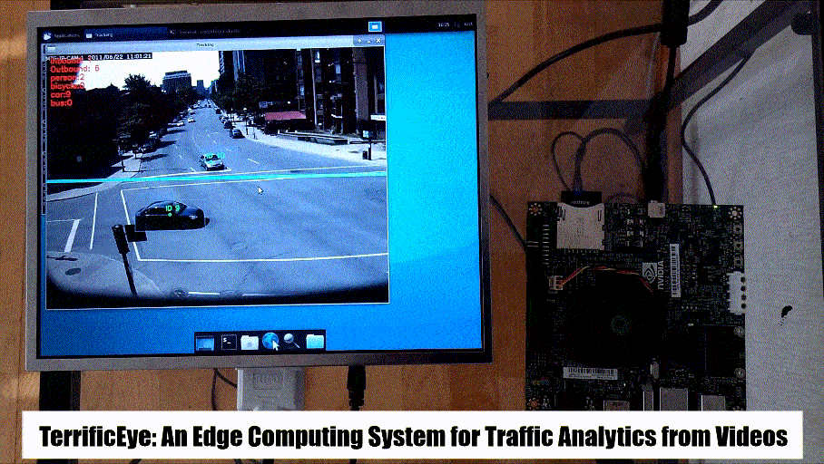
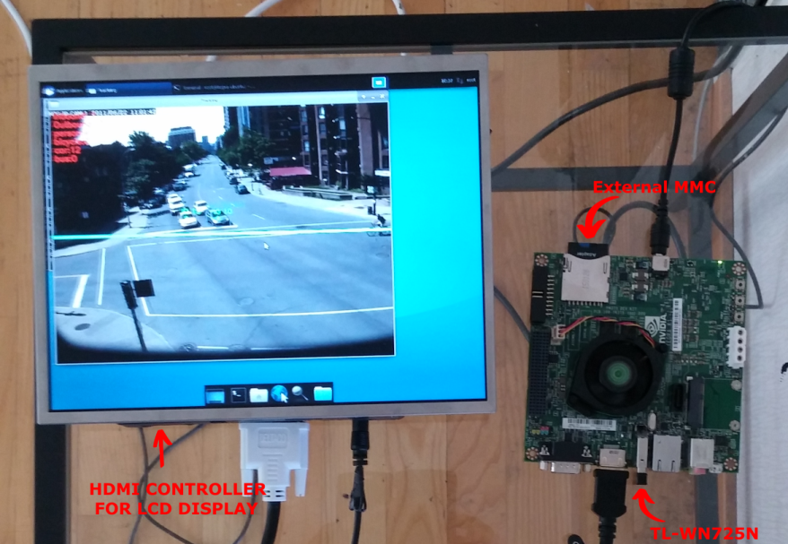

# TerrificEye: An Edge Computing System For Traffic Analytics From Videos




## Requirements

* Python 3
* tensorflow
* DarkNet (Yolov4)
* NVIDIA SoC board (e.g. Jetson TK1, Nano)




## Running The Analyzer

```
python trafic_analyzer.py

```

## References

[1] Joseph Redmon, Santosh Divvala, Ross Girshick, Ali Farhadi, [You Only Look Once: Unified, Real-Time Object Detection](https://arxiv.org/abs/1506.02640), 2016 

[2] DarkNet, https://github.com/pjreddie/darknet


